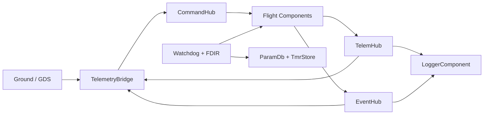

# DELTA-V Autonomy Framework

[](https://github.com/Albertcorn92/Delta-V/actions/workflows/ci.yml)
[](LICENSE)
[](https://github.com/Albertcorn92/Delta-V/tags)
[](https://en.cppreference.com/w/cpp/20)

DELTA-V is a deterministic C++20 flight software framework for civilian
spacecraft, robotics, and research systems. It combines typed ports, generated
topology wiring, fixed-size bounded-copy message paths, and explicit fault
handling in a public baseline that runs on host/SITL and ESP32-class targets.
## Why DELTA-V Exists

Many flight and robotics stacks are strong in one direction but expensive in
another:

- larger flight frameworks can bring substantial process and generation weight
- robotics middleware often prioritizes flexibility over bounded execution
- embedded teams still need a small, testable baseline with clear system wiring

DELTA-V aims at the middle ground: a compact flight-software baseline with
generated topology checks, deterministic message paths, and civilian scope
controls already built into the repository.

## Architecture At A Glance



Core runtime ideas:

- `topology.yaml` is the source of truth for components, IDs, and routes
- `tools/autocoder.py` generates `src/TopologyManager.hpp`, `src/Types.hpp`,
  and `dictionary.json`
- command, telemetry, and event paths use fixed-size packet types over typed
  ports
- backpressure and routing faults are surfaced into component health counters

## 60-Second Quickstart

```bash
python3 -m venv .venv
source .venv/bin/activate
pip install -r requirements.txt

cmake -B build -DCMAKE_BUILD_TYPE=Debug
cmake --build build --target quickstart_10min
```

`quickstart_10min` runs the public local validation path:

- generated-file freshness check
- legal and civilian-scope checks
- unit tests
- system tests
- benchmark guards
- SITL smoke run

If you want the runtime and GDS after that:

```bash
cmake --build build --target flight_software
./build/flight_software

streamlit run gds/gds_dash.py
```

## Reference Mission Example

The repository baseline already includes a civilian CubeSat-style reference
mission profile. Start here:

- [examples/README.md](examples/README.md)
- [examples/cubesat_attitude_control/README.md](examples/cubesat_attitude_control/README.md)
- [docs/REFERENCE_MISSION_WALKTHROUGH.md](docs/REFERENCE_MISSION_WALKTHROUGH.md)

The current example is documentation-backed and uses the main repository
topology rather than a separate example-only binary.

## Design Traits

| Trait | DELTA-V baseline |
|---|---|
| Topology model | generated from `topology.yaml` |
| Message transport | typed ports with fixed-size bounded-copy queues |
| Allocation model | no uncontrolled runtime growth in the core message path |
| Fault handling | explicit `recordError()` and watchdog-visible health counters |
| Link layer | UDP or serial KISS with CCSDS framing |
| Public scope | civilian, research, industrial, educational |

Important wording: DELTA-V is not a true zero-copy framework today. The core
transport is fixed-size, zero-allocation, and bounded-copy.

## How DELTA-V Compares

This is the intended positioning, not a claim that other frameworks are worse
overall:

| Question | DELTA-V | F´ | ROS 2 |
|---|---|---|---|
| Primary focus | compact civilian FSW baseline | large flight-software framework | robotics middleware |
| Generated topology artifacts | yes | yes | no |
| Core public message path | fixed-size bounded-copy ports | deployment-dependent | middleware transport/serialization |
| Public repository scope controls | explicit civilian baseline | project-dependent | general-purpose |

DELTA-V is best read as a smaller, explicit framework baseline for teams that
want a deterministic component graph and visible fault-handling behavior without
turning the repo into a full mission program.

## Current Baseline

The current public baseline passes the main local gates:

- `autocoder_check`
- `quickstart_10min`
- `DeltaV_Unit_Tests`
- `DeltaV_System_Tests`
- `traceability`
- `legal_compliance`

The repository contains a functional framework baseline, not a mission-qualified
flight load. Target timing evidence, long-duration hardware runs, environmental
qualification, and mission-owned uplink/security controls remain outside this
public baseline. It is not certified for operational or safety-critical
deployment.

## Civilian Scope And Contribution Boundary

DELTA-V is published as a civilian public-source framework.

In scope:

- software architecture and runtime behavior
- simulation, tests, and release evidence
- educational, research, and civilian adaptation

Out of scope for the public baseline:

- weapons, targeting, or military mission logic
- command-path crypto/auth additions in the baseline framework
- hardware qualification claims
- direct operational support commitments

Repository changes remain maintainer-controlled. External contribution scope is
intentionally limited; see [CONTRIBUTING.md](CONTRIBUTING.md),
[docs/CIVILIAN_USE_POLICY.md](docs/CIVILIAN_USE_POLICY.md), and
[docs/EXPORT_CONTROL_NOTE.md](docs/EXPORT_CONTROL_NOTE.md), and
[docs/LEGAL_FAQ.md](docs/LEGAL_FAQ.md).
Maintainer does not provide direct operational support to non-U.S. users.

## Common Commands

| Task | Command |
|---|---|
| Verify generated files | `cmake --build build --target autocoder_check` |
| Regenerate topology outputs | `python3 tools/autocoder.py` |
| Build the host runtime | `cmake --build build --target flight_software` |
| Run unit tests | `cmake --build build --target run_tests` |
| Run system tests | `cmake --build build --target run_system_tests` |
| Refresh benchmark artifacts | `cmake --build build --target benchmark_baseline` |
| Run SITL smoke | `cmake --build build --target sitl_smoke` |
| Run the local validation path | `cmake --build build --target quickstart_10min` |
| Generate release artifacts | `cmake --build build --target release_candidate` |
| Build the reviewer bundle | `cmake --build build --target review_bundle` |

## Read Next

- [docs/QUICKSTART_10_MIN.md](docs/QUICKSTART_10_MIN.md)
- [docs/ARCHITECTURE.md](docs/ARCHITECTURE.md)
- [docs/COMPONENT_MODEL.md](docs/COMPONENT_MODEL.md)
- [docs/PORTS_AND_MESSAGES.md](docs/PORTS_AND_MESSAGES.md)
- [docs/SCHEDULER_AND_EXECUTION.md](docs/SCHEDULER_AND_EXECUTION.md)
- [docs/ICD.md](docs/ICD.md)
- [docs/SAFETY_ASSURANCE.md](docs/SAFETY_ASSURANCE.md)
- [docs/README.md](docs/README.md)

## Project Files

- [Contributing guide](CONTRIBUTING.md)
- [Security policy](SECURITY.md)
- [Code of conduct](CODE_OF_CONDUCT.md)
- [Changelog](CHANGELOG.md)
- [Disclaimer](DISCLAIMER.md)

Albert Cornelius. Licensed under Apache-2.0.
