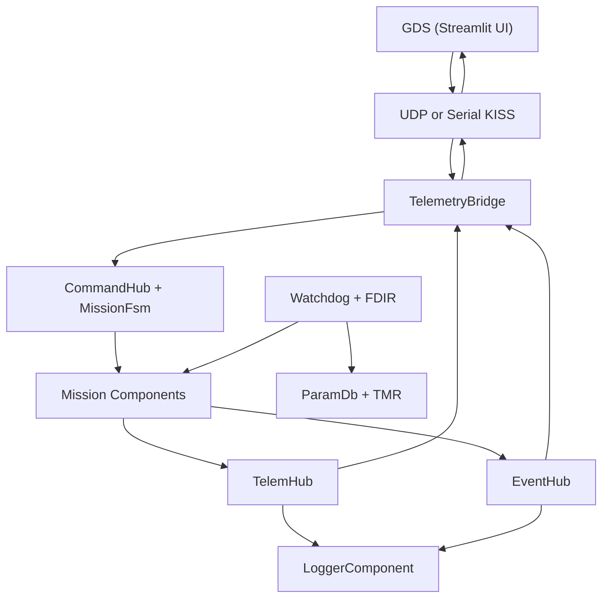
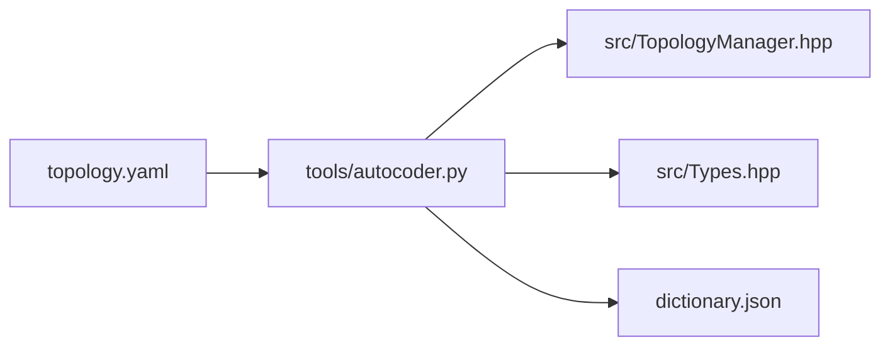

# DELTA-V Architecture Reference

This document describes the runtime layout, generated topology flow, and main
subsystems in the DELTA-V framework.

## Overview

DELTA-V is built around three ideas:

1. topology is declared once in `topology.yaml`
2. the runtime uses a fixed component graph with typed ports
3. validation and release artifacts are generated from the same source tree

The repository follows a high-assurance style, but it does not claim
certification or mission approval by itself.

## Runtime Flow



Command path:

`Ground -> TelemetryBridge -> CommandHub -> target component`

Telemetry path:

`component -> TelemHub -> {TelemetryBridge, LoggerComponent, optional internal listeners}`

Event path:

`component -> EventHub -> {TelemetryBridge, LoggerComponent, optional internal listeners}`

## Generation Flow



`topology.yaml` is the source of truth for:

- component IDs and instances
- command IDs and command classes
- routing expectations
- generated runtime wiring
- ground dictionary contents

Generated outputs:

- `src/TopologyManager.hpp`
- `src/Types.hpp`
- `dictionary.json`

## Execution Model

### Rate Groups

`RateGroupExecutive` is the primary runtime scheduler.

- `FAST`: `10 Hz`
- `NORM`: `1 Hz`
- `SLOW`: `0.1 Hz`
- `ACTIVE`: dedicated component threads on host; cooperative execution on ESP32

Tier overruns and component health are surfaced to the watchdog.

### Passive And Active Components

| Class | Execution model | Typical use |
|---|---|---|
| `Component` | scheduler-owned | control logic, hubs, monitoring |
| `ActiveComponent` | dedicated thread or cooperative task | I/O-heavy components such as the radio link |

The older `Scheduler` abstraction remains in-tree for compatibility and unit
testing, but the normal runtime path uses `RateGroupExecutive`.

## Port Model

The framework uses typed `InputPort<T>` and `OutputPort<T>` pairs backed by a
ring buffer.

Core rules:

- port payload types must satisfy the `FlightData` concept
- command, telemetry, and event flows use explicit packet types
- routing errors are surfaced instead of being ignored
- generated verification checks exact command, telemetry, and event wiring

Key hubs:

| Hub | Purpose |
|---|---|
| `CommandHub` | command routing by component ID and mission-state policy |
| `TelemHub` | telemetry fan-out to bridge, recorder, and internal listeners |
| `EventHub` | event fan-out to bridge, recorder, and internal listeners |

Additional baseline apps include:

- `CommandSequencerComponent`
- `FileTransferComponent`
- `MemoryDwellComponent`
- `TimeSyncComponent`
- `PlaybackComponent`
- `OtaComponent`
- `AtsRtsSequencerComponent`
- `LimitCheckerComponent`
- `CfdpComponent`
- `ModeManagerComponent`

## Mission State And Command Policy

`CommandHub` uses a generated policy map from `topology.yaml` to decide whether
a command is allowed in the current mission state.

Mission state progression:

```text
BOOT -> NOMINAL <-> DEGRADED -> SAFE_MODE -> EMERGENCY
```

Command classes:

- `HOUSEKEEPING`
- `OPERATIONAL`
- `RESTRICTED`

These are declared in `topology.yaml`, not hard-coded in command tables.

## FDIR

`WatchdogComponent` handles fault detection, isolation, and recovery.

Main checks:

1. battery thresholds drive `DEGRADED`, `SAFE_MODE`, and `EMERGENCY`
2. software health counters drive warning and critical responses
3. active components can be restarted up to the configured limit
4. recovery to `NOMINAL` requires healthy subsystems and threshold hysteresis
5. parameter integrity and TMR scrubbing run on a fixed schedule
6. heartbeat events are emitted for link supervision

## Data Integrity And Memory Model

### Static Allocation

Core data structures use fixed bounds and avoid uncontrolled runtime growth.

### Heap Guard

`HeapGuard::arm()` can enforce no-heap-after-init behavior on the host runtime.

- host/SITL: enabled with `DELTAV_ENABLE_HOST_HEAP_GUARD=1`
- ESP32: left off in the baseline profile for compatibility with ESP-IDF and
  FreeRTOS internals

### TMR

Critical parameters can be stored in `TmrStore<T>`.

- three copies are kept
- reads use majority vote
- `TmrRegistry::scrubAll()` repairs drift during watchdog service

## Protocol Stack

DELTA-V uses CCSDS framing on the link layer.

- default transport: UDP
- optional transport: serial KISS
- downlink includes CRC checking
- uplink validates headers, lengths, and replay sequence state

Serial KISS mode uses standard `FEND` / `FESC` framing so the same CCSDS payload
rules can be used over UART.

## Parameter Database

`ParamDb` provides:

- hashed parameter keys
- CRC-protected storage
- thread-safe insert and read behavior for the framework profile
- integration with TMR for critical values

## HAL

The hardware abstraction layer defines interfaces such as:

- `hal::I2cBus`
- `hal::SpiBus`
- `hal::UartPort`
- `hal::PwmOutput`

Host/SITL builds use deterministic mock drivers to support development before
HIL.

## Current Limits

| Item | Status |
|---|---|
| CRC-32 downlink | Planned |
| Full TAI/UTC epoch pipeline | Partial |
| MISRA C++:2023 full compliance | Partial |
| Polyspace / Coverity integration | Planned |

## Read Next

- `docs/DEVELOPER_GUIDE.md`
- `docs/ICD.md`
- `docs/SAFETY_ASSURANCE.md`
