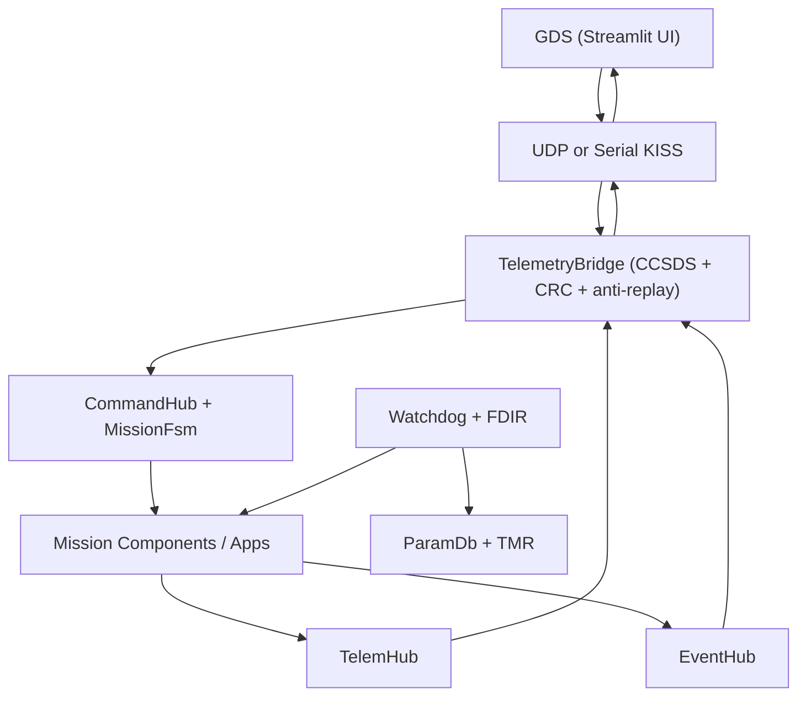
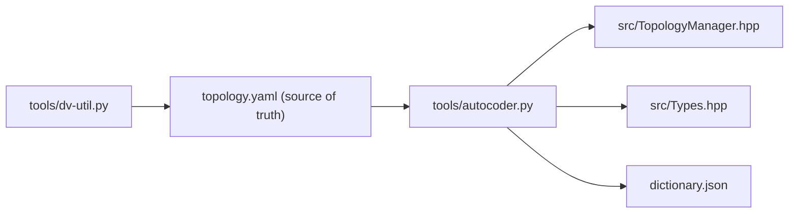

# DELTA-V Flight Software Framework — Architecture Reference  v4.0

---

## 1. Design Philosophy

DELTA-V uses a component-based architecture with deterministic runtime behavior, generated topology wiring, and software assurance tooling. The codebase and documentation follow a DO-178C-influenced style, but the repository does not claim certification by itself.

Its three working rules are:

1. **Catch structural errors early.** Type mismatches fail at compile time, and generated topology checks fail during startup instead of later in mission execution.
2. **Deterministic runtime profile.** Core component graph and data paths are static; host builds can optionally enforce strict no-heap-after-init with `DELTAV_ENABLE_HOST_HEAP_GUARD=1`.
3. **All faults are observable.** Every error path calls `recordError()`, feeds `EventHub`, and is surfaced to the GDS via the telemetry downlink.

### 1.1 Runtime Flow (SITL/Host/ESP)



### 1.2 Generation Flow (Build-Time Source of Truth)



`topology.yaml` drives generated runtime wiring and the ground dictionary:
`tools/autocoder.py` regenerates `src/TopologyManager.hpp`, `src/Types.hpp`,
and `dictionary.json` so runtime and GDS stay synchronized.

---

## 2. Execution Model

### 2.1 The Rate Group Executive (Primary Runtime)

`RateGroupExecutive` is the primary runtime orchestrator in current SITL/host and
ESP profiles. It runs deterministic tiers:

- FAST: `10 Hz`
- NORM: `1 Hz`
- SLOW: `0.1 Hz`
- ACTIVE: dedicated component threads on host; cooperative execution on ESP32

Tier frame drops are counted and surfaced as watchdog health signals.

### 2.2 Active vs. Passive Components

| Class | Thread | Typical Use |
|---|---|---|
| `Component` | Master scheduler thread | Control loops, state logic, hubs |
| `ActiveComponent` | Host: own `Os::Thread` / ESP32: cooperative loop | I/O-bound tasks (radio, future IMU DMA) |

`Os::Thread` uses `sleep_until` (absolute deadline) — **not** `sleep_for` — so wakeup times never drift. On FreeRTOS this maps to `vTaskDelayUntil`.

### 2.3 Legacy Scheduler

The legacy `Scheduler` abstraction remains in-tree for compatibility and focused
unit testing, but production startup paths use `RateGroupExecutive`.

---

## 3. Communication Topology

### 3.1 Port Primitives

Every data flow uses typed `InputPort<T>` / `OutputPort<T>` pairs backed by a thread-safe `RingBuffer<T, Capacity>`. The `FlightData` C++20 concept enforces `trivially_copyable + standard_layout` at compile time.

### 3.2 System Hubs

| Hub | Role |
|---|---|
| `TelemHub` | N-to-M telemetry fan-out (sensors → radio + logger) |
| `CommandHub` | 1-to-N command routing by component ID + MissionFsm gating |
| `EventHub` | N-to-M event broadcast (any component → radio + logger) |
| `CommandSequencerComponent` | Delayed timeline dispatch into `CommandHub` |
| `FileTransferComponent` | Bounded chunk session manager for payload products |
| `MemoryDwellComponent` | Address dwell/patch diagnostics over a bounded memory window |
| `TimeSyncComponent` | Ground-driven UTC synchronization offset service |
| `PlaybackComponent` | Store-and-forward replay of recorder telemetry logs |
| `OtaComponent` | CRC32-verified update staging with reboot-request signaling |
| `AtsRtsSequencerComponent` | Absolute/relative sequence execution with event triggers |
| `LimitCheckerComponent` | Ground-updatable threshold table and alarm generation |
| `CfdpComponent` | CFDP-style chunk receipt/missing tracking |
| `ModeManagerComponent` | Mode-to-command orchestration (detumble/sun/science/downlink) |

### 3.3 Thread Safety

`RingBuffer` is lock-free for the framework's single-producer/single-consumer port model, implemented with atomic head/tail indices (no mutex/spinlock in the data path). Active components push from producer contexts while scheduler-owned consumers drain in deterministic loops.

---

## 4. FDIR (Fault Detection, Isolation & Recovery)

`WatchdogComponent` supervises every registered subsystem each scheduler tick:

1. **Battery FDIR** (DV-FDIR-01/02/03): SOC thresholds → DEGRADED / SAFE_MODE / EMERGENCY transitions.
2. **Software FDIR** (DV-FDIR-03/04): `reportHealth()` polls error counts → WARNING / CRITICAL escalation.
3. **Restart** (DV-FDIR-04): Up to `MAX_RESTARTS_PER_COMPONENT` (3) automatic thread restarts for `ActiveComponent` failures.
4. **Recovery** (DV-FDIR-05/F-15): DEGRADED auto-recovers to NOMINAL only when all components are healthy and battery exceeds `degraded threshold + hysteresis` (default `+2%`).
5. **ParamDb CRC** (DV-DATA-01): Verified every 30 cycles.
6. **TMR Scrub** (DV-TMR-01): `TmrRegistry::scrubAll()` called every 30 cycles to repair SEU-corrupted parameter copies.
7. **Heartbeat** (DV-FDIR-06): Emitted every 10 cycles for GDS communication-loss detection.
8. **Hardware watchdog integration**: On ESP runtime paths, the cooperative rate-group loop registers and services the task watchdog each FAST cycle so scheduler hangs fail closed via watchdog reset.

### 4.1 Mission FSM

`CommandHub` classifies each command using an auto-generated policy map keyed by
`(target_id, opcode)` from `topology.yaml` `commands[].op_class`, then calls
`MissionFsm::isAllowed(state, op_class)` before dispatch. This keeps FSM
permissions source-of-truth in topology metadata instead of hard-coded opcode tables.

```
BOOT → NOMINAL ⇆ DEGRADED → SAFE_MODE → EMERGENCY
                     ↑___auto-recovery___|
```

---

## 5. Memory Architecture

### 5.1 Static Allocation Model

All arrays are `std::array<T, N>` with compile-time bounds. Core flight paths are
designed to avoid runtime heap growth.

### 5.2 HeapGuard

`HeapGuard::arm()` overrides `operator new` and `operator new[]` globally.

- Host/SITL: strict mode is opt-in via `DELTAV_ENABLE_HOST_HEAP_GUARD=1`.
- ESP baseline profile: heap guard runtime lock is disabled by default for
  compatibility with ESP-IDF/FreeRTOS internals.

### 5.3 Triple Modular Redundancy (TmrStore)

Critical floating-point parameters (PID gains, burn durations) are stored in `TmrStore<float>` — three independent memory copies. On `read()`, a majority vote detects single-bit upsets and self-heals. `TmrRegistry::scrubAll()` (called by Watchdog) proactively repairs drift.

---

## 6. Networking / Protocol Stack

```
Application data
      │
      ▼
CCSDS Header (10B): sync=0x1ACFFC1D | APID | SeqCount | Length
      │
      ▼  + CRC-16/CCITT (2B) on downlink
      │  + strict header/length validation on uplink
      │
      ▼
Transport mode:
  - UDP (default, SITL)
  - UART KISS (DELTAV_LINK_MODE=serial_kiss)
```

### Sync Word

`0x1ACFFC1D` is the CCSDS standard sync marker (replaces the incorrect `0xDEADBEEF` noted in earlier ARCHITECTURE.md versions).

### KISS Framing (Serial Mode)

Serial mode wraps CCSDS frames in KISS delimiters with byte-escaping:

- `FEND` frame boundary (`0xC0`)
- `FESC TFEND` escape for embedded `FEND`
- `FESC TFESC` escape for embedded `FESC`

This gives deterministic frame boundaries on UART links while keeping the same
CCSDS payload rules and anti-replay uplink checks.

---

## 7. Parameter Database (ParamDb)

- FNV-1a 32-bit hash keys (constexpr, computed at compile time)
- CRC-32 integrity check over all entries
- Thread-safe insert (mutex-serialised find+insert, lock-free read after init)
- Critical params duplicated in `TmrStore` for radiation resilience

---

## 8. Hardware Abstraction Layer

`hal::I2cBus`, `hal::SpiBus`, `hal::UartPort`, and `hal::PwmOutput` are
pure-virtual interfaces. Host SITL includes deterministic mock drivers for SPI,
UART, and PWM to reduce board-specific bring-up work before HIL.

---

## 9. Known Limitations and Planned Upgrades

| Item | Status |
|---|---|
| CRC-32 on downlink (CRC-16 currently) | Planned |
| Rate group executive (10/1/0.1 Hz tiers) | Implemented in runtime path |
| TAI/UTC epoch synchronisation | Partial — UTC offset sync + monotonic UTC clamp implemented; full TAI epoch pipeline planned |
| MISRA C++:2023 full compliance | Partially met (enforced by Wconversion, Wshadow, Wformat=2) |
| Polyspace / Coverity integration | Planned |
