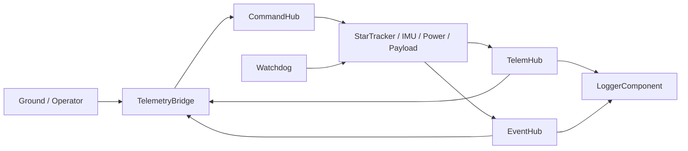

# CubeSat Attitude Control Reference Mission

This example describes the public DELTA-V reference mission profile as a
civilian 3U CubeSat-style system. It uses the repository's default
`topology.yaml` and host runtime rather than a separate example-only build.

## Mission Shape

Mission intent:

- monitor power state and software health
- simulate attitude-awareness inputs from a star tracker and IMU
- route telemetry and events through a radio link and recorder
- exercise a bounded civilian payload profile under command policy controls

Representative components from the default topology:

- `WatchdogComponent`
- `TelemetryBridge`
- `CommandHub`
- `TelemHub`
- `EventHub`
- `LoggerComponent`
- `SensorComponent` as `StarTracker`
- `ImuComponent` as `IMU_01`
- `PowerComponent` as `BatterySystem`
- `PayloadMonitorComponent`
- `ModeManagerComponent`

## Runtime Picture



## What This Example Demonstrates

- generated topology wiring from `topology.yaml`
- deterministic fixed-size command, telemetry, and event paths
- watchdog-visible fault handling for queue backpressure and routing failures
- recorder and bridge fan-out through `TelemHub` and `EventHub`
- mission-state command gating through `CommandHub`

## First Run

From the repository root:

```bash
python3 -m venv .venv
source .venv/bin/activate
pip install -r requirements.txt

cmake -B build -DCMAKE_BUILD_TYPE=Debug
cmake --build build --target quickstart_10min
cmake --build build --target flight_software
./build/flight_software
```

Optional operator view:

```bash
streamlit run gds/gds_dash.py
```

## Example Command Set

The default topology exposes commands such as:

- `RESET_BATTERY`
- `SET_DRAIN_RATE`
- `SET_STAR_AMPLITUDE`
- `IMU_RECALIBRATE`
- `PAYLOAD_SET_ENABLE`
- `PAYLOAD_CAPTURE_SAMPLE`
- `PAYLOAD_SET_GAIN`

Those command IDs, opcodes, and policy classes are declared in `topology.yaml`
and reflected into generated outputs such as `dictionary.json`.

## Files To Read With This Example

- [topology.yaml](../../topology.yaml)
- [docs/REFERENCE_MISSION_WALKTHROUGH.md](../../docs/REFERENCE_MISSION_WALKTHROUGH.md)
- [docs/ARCHITECTURE.md](../../docs/ARCHITECTURE.md)
- [docs/ICD.md](../../docs/ICD.md)
- [docs/process/REFERENCE_MISSION_PROFILE.md](../../docs/process/REFERENCE_MISSION_PROFILE.md)

## Boundary

This example is a public civilian reference mission profile. It is not a claim
of mission qualification, operational approval, or export/legal clearance for a
specific deployment.
